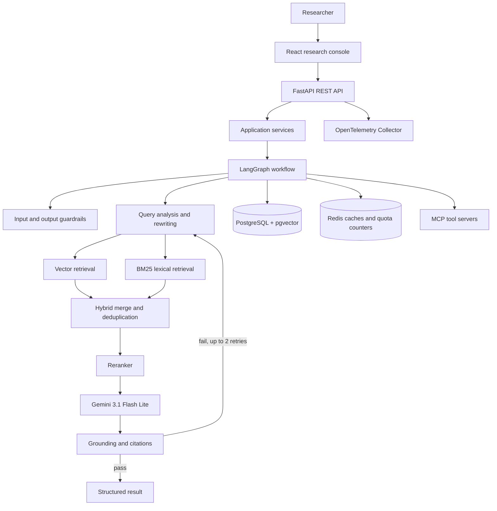
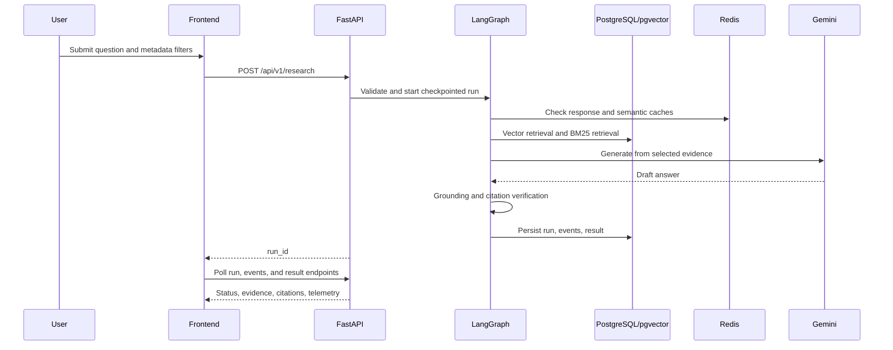

# Sustainability Intelligence Platform

An agentic RAG platform for evidence-backed sustainability research at **GreenTech Industries**. Users ask questions about energy, emissions, water, climate, and sustainability strategy; the platform retrieves supporting knowledge, generates an answer, checks grounding, and exposes evidence and workflow activity in the React console.

## Highlights

| Capability | Implementation |
| --- | --- |
| API | FastAPI with predictable REST endpoints |
| Workflow | LangGraph supervisor, explicit state, `Send` fan-out, checkpoints, corrective-RAG routing |
| Retrieval | PostgreSQL/pgvector vector search plus BM25 lexical search, merge, and reranking |
| Generation | Gemini 3.1 Flash Lite with local extractive fallback for development |
| Knowledge | Markdown and text ingestion with chunking, embeddings, metadata, and content-hash deduplication |
| Cache | Redis embedding, response, retrieval helpers, semantic cache, and quota counters |
| Safety | Input injection/PII checks, grounded output validation, and action risk tiers |
| Tools | Knowledge, sustainability-data, and report FastMCP servers |
| Operations | OpenTelemetry FastAPI instrumentation and Gemini RPM/TPM/RPD monitoring |
| Evaluation | RAGAS dataset and baseline result runner |

## System Architecture



## Research Lifecycle



## Quick Start

### Prerequisites

- Docker Desktop with Compose
- A Gemini API key for live generation and embeddings
- Ports `5173`, `8000`, `5432`, `6379`, `4317`, and `4318` available

### Configure

1. Copy the safe values from [.env.example](.env.example) into [backend/.env](backend/.env).
2. Set `GEMINI_API_KEY` in `backend/.env` for live Gemini calls. Never commit it.
3. Keep [frontend/.env.local](frontend/.env.local) configured with `VITE_API_URL=http://localhost:8000`.

The root `.env.example` is a template; Compose loads `backend/.env`, while Vite reads `frontend/.env.local` during local development. [otel-collector-config.yaml](otel-collector-config.yaml) is required by the Compose OTEL service.

### Start the stack

```bash
docker compose up --build
```

Open `http://localhost:5173` and API docs at `http://localhost:8000/docs`.

```bash
curl http://localhost:8000/health
docker compose ps
```

Stop services while retaining volumes:

```bash
docker compose down
```

Remove services and volumes:

```bash
docker compose down -v
```

## API Overview

| Method | Endpoint | Purpose |
| --- | --- | --- |
| `GET` | `/health` | Service health check |
| `POST` | `/api/v1/research` | Validate a question and create a research run |
| `GET` | `/api/v1/runs/{run_id}` | Read status, current node, and progress |
| `GET` | `/api/v1/runs/{run_id}/events` | Read persisted agent/workflow events |
| `GET` | `/api/v1/runs/{run_id}/result` | Read answer, citations, grounding, cache, and quota metadata |
| `GET` | `/api/v1/documents` | List indexed documents with optional filters |
| `POST` | `/api/v1/documents/ingest` | Read, chunk, embed, and index an `.md` or `.txt` file |
| `GET` | `/api/v1/runs/{run_id}/approval` | Read pending report approval state |
| `POST` | `/api/v1/runs/{run_id}/approval` | Approve, edit, or reject an action |

Example request:

```json
{
  "query": "How has our renewable energy target changed from 2024 to 2026?",
  "filters": {"category": "energy", "year_from": 2024, "year_to": 2026},
  "options": {"use_rag": true, "use_reranker": true, "use_citations": true}
}
```

## Repository Layout

```text
backend/       FastAPI, LangGraph, RAG, persistence, MCP, guardrails, OTEL
frontend/      React/Vite research console
knowledge/     Markdown and text sustainability knowledge base
evaluation/    Question fixtures and generated evaluation results
docker-compose.yml
otel-collector-config.yaml
```

## Project Status

The core application path is implemented and locally buildable. The RAGAS runner currently creates a baseline result file with metric placeholders; expand [evaluation/datasets](evaluation/datasets) and connect metric scoring before treating evaluation as a release gate. Authentication, multi-user permissions, and production secret management are intentionally outside this learning project.

## Documentation

- [Backend README](backend/README.md)
- [Frontend README](frontend/README.md)
- [Project LLD](SUSTAINABILITY_INTELLIGENCE_lld.md)
- [Test README](TEST.md)
- [MIT License](LICENSE.md)
  
