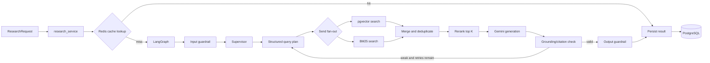

# Backend

FastAPI and LangGraph service for the Sustainability Intelligence Platform. The API layer stays thin; application services coordinate persistence and workflow execution, while RAG, guardrails, cache, MCP, and observability modules own their respective concerns.

## Responsibilities

| Layer | Location | Responsibility |
| --- | --- | --- |
| API | `app/main.py`, `app/api/routes/` | HTTP validation, status codes, and response contracts |
| Services | `app/services/` | Run, document, and approval orchestration |
| Workflow | `app/graph/`, `app/agents/` | Explicit LangGraph state, nodes, routing, checkpoints, and agent roles |
| RAG | `app/rag/` | Loading, chunking, embeddings, pgvector, BM25, hybrid merge, reranking, grounding, and citations |
| Infrastructure | `app/db/`, `app/models/`, `app/cache/` | SQLAlchemy models, pgvector persistence, and Redis cache primitives |
| Safety | `app/guardrails/` | Input injection/PII checks, output grounding checks, and action risk tiers |
| Tools | `app/mcp/` | Knowledge, sustainability-data, and report FastMCP servers |
| Operations | `app/observability/` | OpenTelemetry setup and Gemini usage counters |
| Evaluation | `app/evaluation/` | Dataset loading and baseline result generation |

## Data and Workflow



## Local Setup

From the repository root:

```bash
python -m venv .venv
# Windows PowerShell
.venv\Scripts\Activate.ps1
# macOS/Linux: source .venv/bin/activate
pip install -r backend/requirements.txt
```

Configure `backend/.env` using the root [.env.example](../.env.example). For local execution, PostgreSQL with the `vector` extension and Redis must be running. The simplest route is Compose:

```bash
docker compose up -d postgres redis otel-collector
```

PowerShell:

```powershell
$env:PYTHONPATH="backend"
uvicorn app.main:app --reload --port 8000
```

The API initializes tables and attempts knowledge-base ingestion during startup. Ingestion accepts only `.md` and `.txt` files and skips documents whose content hash is already indexed.

## API Contracts

| Endpoint | Input | Output |
| --- | --- | --- |
| `POST /api/v1/research` | Question, filters, options | `run_id` and queued status |
| `GET /api/v1/runs/{id}` | Run identifier | Status, node, progress, timestamps |
| `GET /api/v1/runs/{id}/events` | Run identifier | Agent and workflow event list |
| `GET /api/v1/runs/{id}/result` | Run identifier | Answer, citations, grounding, retrieval, cache, quota metadata |
| `GET /api/v1/documents` | `category`, `topic`, `year`, `region` filters | Indexed document summaries |
| `POST /api/v1/documents/ingest` | Path, category, topic, year, region | Document ID and chunk count |
| `GET /api/v1/runs/{id}/approval` | Run identifier | Pending action, risk level, payload, options |
| `POST /api/v1/runs/{id}/approval` | Approval ID, decision, optional edited payload | Resumed decision status |

FastAPI documentation is available at `http://localhost:8000/docs`.

## Configuration

| Variable | Default | Meaning |
| --- | --- | --- |
| `GEMINI_MODEL` | `gemini-3.1-flash-lite` | Generation model |
| `GEMINI_EMBEDDING_MODEL` | `models/text-embedding-004` | Embedding model |
| `GEMINI_MAX_RPM` | `15` | Requests-per-minute monitoring limit |
| `GEMINI_MAX_TPM` | `250000` | Tokens-per-minute monitoring limit |
| `GEMINI_MAX_RPD` | `500` | Requests-per-day monitoring limit |
| `RETRIEVAL_TOP_K` | `20` | Candidate count per retrieval path |
| `RERANK_TOP_K` | `8` | Evidence count sent to generation |
| `MAX_RAG_RETRIES` | `2` | Corrective-RAG retry ceiling |
| `SEMANTIC_CACHE_THRESHOLD` | `0.92` | Semantic-cache similarity threshold |

If `GEMINI_API_KEY` is empty, embeddings use a deterministic local fallback and generation uses an extractive fallback. Live Gemini behavior requires the key.

## MCP Servers

Run individual servers over stdio when integrating with an MCP host:

```bash
python -m app.mcp.knowledge_server
python -m app.mcp.sustainability_data_server
python -m app.mcp.report_server
```

The report server exposes side-effecting tools, so callers should apply the action risk gate and approval workflow before saving reports.

## Evaluation

The starter dataset is at [evaluation/datasets/sustainability_questions.json](../evaluation/datasets/sustainability_questions.json). From the repository root:

```powershell
$env:PYTHONPATH="backend"
python -c "from app.evaluation.ragas_runner import run_baseline; print(run_baseline())"
```

The generated file is written to `evaluation/results/latest.json`. The current runner creates the result contract; metric values remain placeholders until full RAGAS scoring is connected.

## Validation

```bash
python -m compileall backend/app
```
