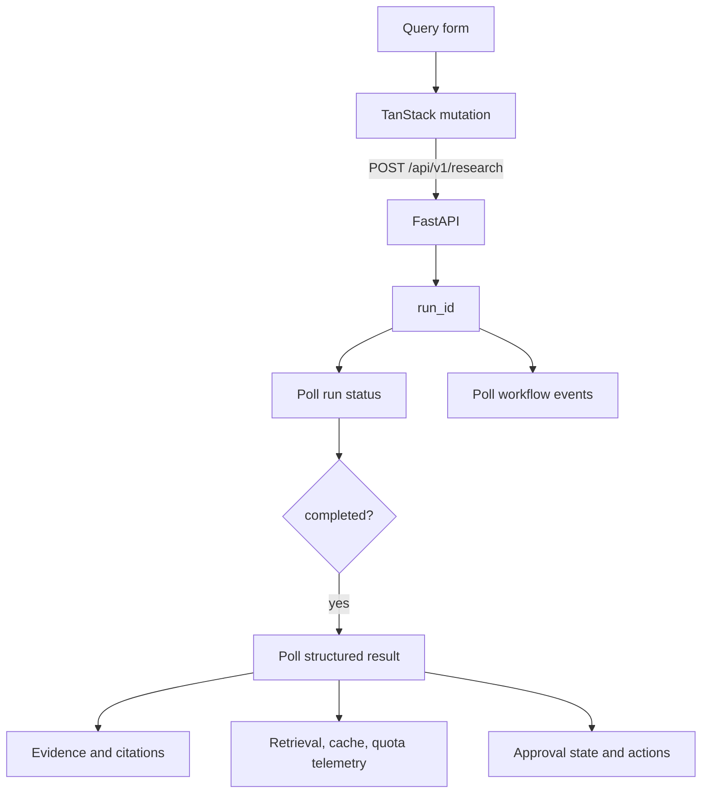

# Frontend

React 19 and Vite research console for the Sustainability Intelligence Platform. The interface is focused on one workflow: ask a question, watch the run, inspect evidence, and review the grounded answer or approval state.

## Stack

| Tool | Role |
| --- | --- |
| React 19 + TypeScript | UI and type-safe application code |
| Vite | Development server and production bundling |
| TanStack Query | Run/result/event polling and server-state caching |
| Zustand | Client-side store for the active query and run ID |
| Tailwind CSS v4 | Utility styling foundation |
| Framer Motion | Research workspace transitions |
| Lucide React | Interface icons |
| Oxlint | Fast JavaScript/TypeScript linting |

## UI Data Flow



## Components

| Component | Purpose |
| --- | --- |
| `ResearchPage` | Coordinates form state, API queries, and page layout |
| `WorkflowTimeline` | Displays guardrail, supervisor, retrieval, generation, and grounding stages |
| `EvidencePanel` | Shows expandable citation evidence and relevance scores |
| `RetrievalPanel` | Shows vector, BM25, and reranked counts |
| `AgentActivity` | Displays persisted workflow events |
| `CachePanel` | Displays cache state and Gemini quota limits |
| `ResultView` | Displays grounded answer and model metadata |
| `ApprovalPanel` | Sends approve, edit, or reject decisions to the backend |

## Local Development

```bash
npm install
npm run dev
```

The application runs at `http://localhost:5173`. Set `VITE_API_URL` in [.env.local](.env.local) when the backend is hosted elsewhere:

```env
VITE_API_URL=http://localhost:8000
```

Start the backend separately or use the full root Compose stack:

```bash
docker compose up --build
```

## Commands

| Command | Purpose |
| --- | --- |
| `npm run dev` | Start the Vite development server |
| `npm run build` | Type-check and create a production bundle |
| `npm run lint` | Run Oxlint |
| `npm run preview` | Serve the production bundle locally |

## API Expectations

The frontend expects:

- `POST /api/v1/research` returning `{ "run_id": "...", "status": "queued" }`.
- `GET /api/v1/runs/{run_id}` for status and progress.
- `GET /api/v1/runs/{run_id}/events` for workflow activity.
- `GET /api/v1/runs/{run_id}/result` for answer, citations, grounding, retrieval, cache, and quota data.
- `GET` and `POST /api/v1/runs/{run_id}/approval` for backend-driven HITL actions.

The browser calls `http://localhost:8000` directly in the default Compose setup, so the backend CORS policy must allow the Vite origin.

## Production Build

```bash
npm run build
```

The generated `dist/` directory is ignored by Git. The current Docker image runs Vite’s host-accessible development server for local Compose use; use a static web server or reverse proxy for production deployment.
